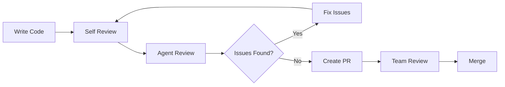

# 🤖 AI Agent Documentation

Dokumentasi lengkap untuk menggunakan AI Agent dalam menganalisis, mereview, dan mengoptimasi codebase **Berita Finansial**.

---

## 📚 Dokumentasi Available

| File                                                     | Deskripsi                        | Use Case                                  |
| -------------------------------------------------------- | -------------------------------- | ----------------------------------------- |
| **[agent-instructions.md](./agent-instructions.md)**     | 📖 Instruksi lengkap untuk Agent | Setup Agent capabilities & behavior       |
| **[agent-quick-start.md](./agent-quick-start.md)**       | 🚀 Quick start guide & tips      | Mulai menggunakan Agent dengan cepat      |
| **[agent-templates.md](./agent-templates.md)**           | 📋 Template analisis siap pakai  | Copy-paste templates untuk scenarios umum |
| **[copilot-instructions.md](./copilot-instructions.md)** | ⚙️ GitHub Copilot instructions   | Project-specific Copilot settings         |

---

## 🎯 Quick Start

### 1. Setup Agent

Berikan file `agent-instructions.md` kepada AI Agent Anda (GitHub Copilot, Claude, ChatGPT, dll) untuk mengaktifkan capabilities.

### 2. Pilih Template

Lihat `agent-templates.md` untuk menemukan template yang sesuai dengan kebutuhan:

- 📝 Code Review
- 🐛 Bug Investigation
- ⚡ Performance Audit
- 🔒 Security Review
- 🧪 Testing Strategy
- Dan lainnya...

### 3. Jalankan Analisis

Copy template, customize sesuai kebutuhan, dan paste ke Agent.

---

## 💡 Common Use Cases

### Use Case 1: Daily Code Review

```
Setiap PR → Copy "New Feature Review Template" → Run review → Fix issues → Merge
```

### Use Case 2: Performance Issue

```
User report slowness → Use "Performance Bottleneck Template" → Identify issue → Optimize → Verify
```

### Use Case 3: Security Audit

```
Before launch → Run "Security Review Template" → Fix vulnerabilities → Retest → Deploy
```

### Use Case 4: Refactoring

```
Tech debt sprint → Use "Refactoring Proposal Template" → Get approval → Migrate → Test
```

---

## 🛠️ Tools & Commands

### Essential Commands Agent Should Know

```bash
# Code Analysis
grep_search "pattern" --isRegexp --includePattern="**/*.tsx"
semantic_search "authentication logic"
file_search "**/*.tsx"
list_code_usages "functionName"

# Validation
get_errors
npm run lint
npx tsc --noEmit
npm run build

# File Operations
read_file "path/to/file.tsx"
list_dir "app/components"
```

---

## 📊 Review Quality Checklist

Setiap review dari Agent harus include:

- ✅ **Executive Summary** (Overall health, score, top issues)
- ✅ **Prioritized Issues** (🔴 Critical | 🟡 Important | 🟢 Nice-to-have)
- ✅ **Code Examples** (Before/after untuk setiap issue)
- ✅ **WHY Explanations** (Not just what to fix, but why)
- ✅ **Effort Estimates** (Low/Medium/High untuk setiap fix)
- ✅ **Testing Recommendations** (How to verify fixes)
- ✅ **References** (Links to official docs)

---

## 🎓 Best Practices

### For Developers

**Do's** ✅

- Berikan konteks yang jelas ke Agent
- Review semua suggestions sebelum implement
- Run tests setelah setiap change
- Document decisions dalam code comments
- Update documentation sesuai changes

**Don'ts** ❌

- Jangan implement tanpa understand WHY
- Jangan skip validation steps
- Jangan ignore security concerns
- Jangan merge tanpa review
- Jangan lupa update tests

### For Reviewers

**Do's** ✅

- Verify Agent's findings manually
- Ask for clarification jika unclear
- Consider project context (deadline, team skill)
- Balance ideal vs practical solutions
- Document unusual decisions

**Don'ts** ❌

- Jangan trust Agent 100% tanpa verification
- Jangan apply changes blindly
- Jangan ignore edge cases
- Jangan skip testing
- Jangan lupa backward compatibility

---

## 📈 Metrics to Track

Track improvement dari Agent usage:

| Metric             | Target     | Current | How to Measure               |
| ------------------ | ---------- | ------- | ---------------------------- |
| Code Quality Score | 9/10       | ?       | Agent review score           |
| Test Coverage      | 70%+       | ?       | `npm run test -- --coverage` |
| TypeScript Errors  | 0          | ?       | `npx tsc --noEmit`           |
| ESLint Errors      | 0          | ?       | `npm run lint`               |
| Build Time         | < 30s      | ?       | `time npm run build`         |
| Bundle Size        | < 250KB    | ?       | Build output                 |
| Lighthouse Score   | > 95       | ?       | `npm run lighthouse`         |
| Security Issues    | 0 Critical | ?       | `npm audit`                  |

---

## 🔄 Workflow Integration

### Development Workflow



### CI/CD Integration

```yaml
# .github/workflows/code-quality.yml
name: Code Quality

on: [pull_request]

jobs:
  lint:
    runs-on: ubuntu-latest
    steps:
      - uses: actions/checkout@v3
      - run: npm install
      - run: npm run lint

  typecheck:
    runs-on: ubuntu-latest
    steps:
      - uses: actions/checkout@v3
      - run: npm install
      - run: npx tsc --noEmit

  test:
    runs-on: ubuntu-latest
    steps:
      - uses: actions/checkout@v3
      - run: npm install
      - run: npm test

  build:
    runs-on: ubuntu-latest
    steps:
      - uses: actions/checkout@v3
      - run: npm install
      - run: npm run build
```

---

## 📅 Review Schedule

| Review Type               | Frequency            | Template             | Owner             |
| ------------------------- | -------------------- | -------------------- | ----------------- |
| Daily Code Review         | Every PR             | New Feature Review   | Dev + Agent       |
| Weekly Security Scan      | Weekly               | Security Review      | Lead Dev + Agent  |
| Monthly Performance Audit | Monthly              | Performance Audit    | Tech Lead + Agent |
| Quarterly Refactoring     | Quarterly            | Refactoring Proposal | Team + Agent      |
| Pre-launch Full Audit     | Before major release | All templates        | Everyone + Agent  |

---

## 🆘 Troubleshooting

### Agent Not Providing Detailed Enough Analysis?

**Solution**: Be more specific in your request

```
❌ "Review this component"
✅ "Review ArticleCard component focusing on performance and accessibility. Check for unnecessary re-renders, missing ARIA labels, and memoization opportunities. Provide before/after code examples."
```

### Agent Suggestions Not Practical?

**Solution**: Add constraints to your request

```
✅ "Review with these constraints:
- Must maintain backward compatibility
- Max 2 days effort
- No breaking changes to API
- Team has intermediate TypeScript skills"
```

### Agent Missing Context?

**Solution**: Provide more background

```
✅ "This component is used in 15+ pages, handles user authentication state, and must support both mobile and desktop. Current issues: slow on mobile, sometimes loses auth state on reload."
```

---

## 🎯 Success Stories

### Example 1: Found Critical Security Issue

```
Agent identified unprotected API route → Fixed in 1 hour → Prevented potential data breach
Impact: High
Effort: Low
```

### Example 2: Optimized Bundle Size

```
Agent suggested replacing moment.js with date-fns → Reduced bundle by 40KB → Faster page loads
Impact: Medium
Effort: Medium
```

### Example 3: Improved Type Safety

```
Agent found 47 'any' types → Replaced with proper types → Caught 12 bugs in development
Impact: High
Effort: High
```

---

## 📖 Additional Resources

### Official Documentation

- [Next.js 16 Docs](https://nextjs.org/docs)
- [React 19 Docs](https://react.dev)
- [TypeScript Handbook](https://www.typescriptlang.org/docs)
- [Tailwind CSS v4](https://tailwindcss.com/docs)

### Community Resources

- [Next.js GitHub Discussions](https://github.com/vercel/next.js/discussions)
- [React Working Group](https://github.com/reactwg)
- [TypeScript Community](https://www.typescriptlang.org/community)

### Internal Docs

- [Project Summary](../PROJECT_SUMMARY.md)
- [Getting Started](../GETTING_STARTED.md)
- [Commands](../COMMANDS.md)
- [Deployment](../DEPLOYMENT.md)

---

## 🤝 Contributing

Found issue dengan Agent instructions atau templates? Improve them!

1. Edit relevant file (`agent-instructions.md`, `agent-templates.md`, etc)
2. Test dengan actual use case
3. Document perubahan
4. Share dengan team

---

## 📝 Changelog

### 2025-11-04

- ✅ Created initial agent-instructions.md
- ✅ Added agent-quick-start.md with practical examples
- ✅ Created agent-templates.md with 10 common scenarios
- ✅ Added this README for overview

---

## 📞 Support

Questions? Issues?

- Check `agent-quick-start.md` untuk troubleshooting tips
- Review `agent-templates.md` untuk example scenarios
- Update `agent-instructions.md` jika Agent needs new capabilities

---

**Version**: 1.0.0  
**Last Updated**: November 4, 2025  
**Maintained By**: Berita Finansial Team  
**License**: Internal Use Only
